<!--
  ═══════════════════════════════════════════════════════════════
  RALIQ HIDAYAT BM3 — TRAVELER PROFILE
  Genshin-inspired, animated, original. All layout & vector art
  self-made in ./assets/*.svg (GitHub-safe). Generated by:
  node scripts/generate-assets.mjs — character icons © HoYoverse,
  fan decoration only, no affiliation or ownership claimed.
  ═══════════════════════════════════════════════════════════════
-->


<table width="100%">
<tr>
<td width="62%" valign="middle">

  

 

<kbd>✦ PROCEED</kbd>

  

</td>
<td width="38%" valign="middle" align="center">

  

  

</td>
</tr>
</table>

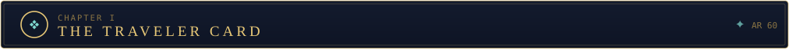

<table width="100%">
<tr>
<td width="32%" valign="top" align="center">

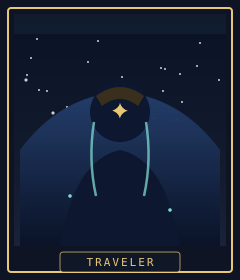

 

 

</td>
<td width="68%" valign="top">

**RALIQ HIDAYAT BM3** — a fullstack traveler from Indonesia 🇮🇩 with a questionable specialty: **automating things that deserve it**. Orders, invoices, PRDs — every manual process is a weekly boss that respects nobody.

By day: Laravel controllers and Next.js routes. By night: dark WebGL landings nobody commissioned. In between: AI agents that actually ship.

 

<pre>
ADVENTURE VITALS
────────────────────────────────────────────
RESIN      ███████████████████░  198/200
PRIMOGEMS  █░░░░░░░░░░░░░░░░░░░    24 / 2450
IDEAS      ███████████████████░  overflowing
PITY       ███████████████░░░░░   73/90  (don't look)
SLEEP      ████░░░░░░░░░░░░░░░░  critical!
</pre>

</td>
</tr>
</table>

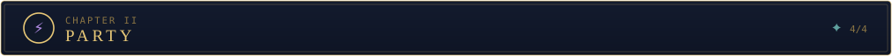

<table width="100%">
<tr>
<td width="25%" valign="top" align="center">

**FORGE** · Geo
Idea → PRD → spec. Contracts, not vibes.
<kbd>LV.90</kbd>

</td>
<td width="25%" valign="top" align="center">

<a href="https://github.com/kouji999/wa-commerce-os">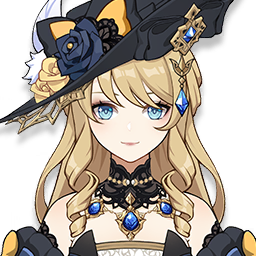</a>

**WA COMMERCE OS** · Hydro
Sales deals flowing like Fontaine water.
<kbd>LV.86</kbd>

</td>
<td width="25%" valign="top" align="center">

<a href="https://github.com/kouji999/SmartStudy-AI">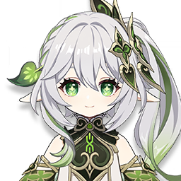</a>

**SMARTSTUDY AI** · Dendro
Wisdom on tap. The tutor never sleeps.
<kbd>LV.84</kbd>

</td>
<td width="25%" valign="top" align="center">

<a href="https://github.com/kouji999/striv">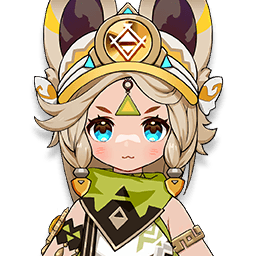</a>

**STRIV** · Electro
Sprints, PRs, personal bests.
<kbd>LV.78</kbd>

</td>
</tr>
<tr>
<td valign="top" align="center">

<a href="https://github.com/kouji999/PRDForge">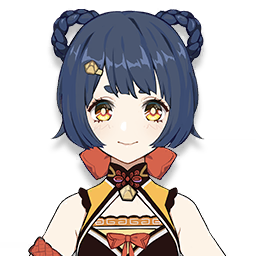</a>

**PRDFORGE** · Pyro
Cooking raw requirements into 5★ PRDs.
<kbd>LV.76</kbd>

</td>
<td valign="top" align="center">

<a href="https://github.com/kouji999/noir-studio">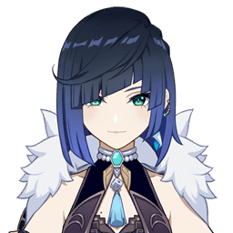</a>

**NOIR · TECHCORE** · Hydro
Night ops: dark landings, never seen shipping.
<kbd>LV.75</kbd>

</td>
<td valign="top" align="center">

<a href="https://github.com/kouji999/learnlaravel">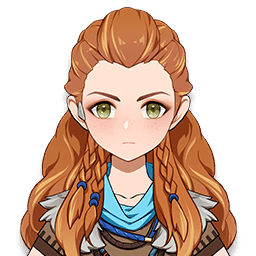</a>

**LEARNLARAVEL** · Cryo
The foundation. Basics, mastered.
<kbd>LV.70</kbd>

</td>
<td valign="top" align="center">

**???** · Unknown
A Snezhnaya-bound repo is hatching…
<kbd>WAITING</kbd>

</td>
</tr>
</table>

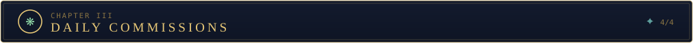

<table width="100%">
<tr>
<td width="60%" valign="top">

- 🌟 **MAIN STORY** — the FORGE family: raw idea in, build-ready bundle out. <kbd>ONGOING</kbd>
- ⚔️ **WEEKLY BOSS** — wa-commerce-os & wifi-billing-os: WhatsApp money robots for real merchants. <kbd>TUESDAYS</kbd>
- 🌙 **NIGHT RAID** — WebGL dark landings nobody asked for, shipped anyway. <kbd>EVERY NIGHT</kbd>
- 🧭 **SCRIPTURE** — grinding the TypeScript constellation to C6. <kbd>ACTIVE</kbd>
- ❄️ **EXPEDITION** — a character… er, *project* sent to Snezhnaya. <kbd>???</kbd>

</td>
<td width="40%" valign="top" align="center">

*PAIMON — emergency food, senior code reviewer.*

<pre>
CURRENT STATUS
──────────────────────────────
&gt; shipping:   ALWAYS
&gt; region:     Indonesia 🇮🇩
&gt; resin:      198/200 — spend it all
&gt; pity:       73/90 (LOOK AWAY, PAIMON)
&gt; blockers:   none
</pre>

</td>
</tr>
</table>

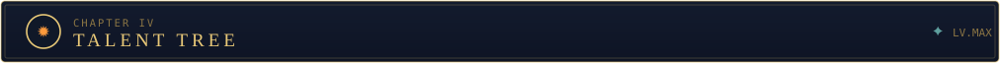

  

<table width="100%">
<tr>
<td width="55%" valign="top">

**ASCENDED TALENTS**

   

 

   

</td>
<td width="45%" valign="top" align="center">

*This stack is the **Traveler** — it resonates with whichever*
*Archon the contract demands: Laravel today,*
*Next.js tomorrow, Blender in the domain between.*

</td>
</tr>
</table>

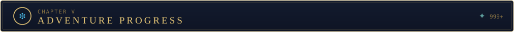

  

<table width="100%">
<tr>
<td width="56%" valign="top" align="center">

</td>
<td width="44%" valign="top" align="center">

</td>
</tr>
<tr>
<td valign="top" align="center">

</td>
<td valign="top" align="center">

<!-- generated onto the output branch by .github/workflows/snake.yml; appears after its first run -->

</td>
</tr>
</table>

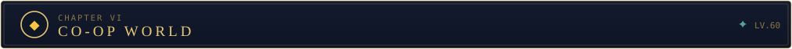

<table width="100%">
<tr>
<td width="36%" valign="top" align="center">

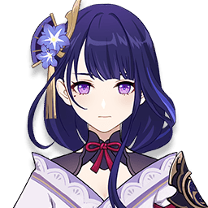

*Do not provoke the Musou no Hitotachi.*
*(Open an issue instead.)*

</td>
<td width="64%" valign="top">

**CO-OP REQUESTS ARE OPEN** — Adventurers ≥ AR 30. Bring snacks.

Open for trades (ideas), domain runs (pair programming) and event co-op (collabs). If it can be automated, Paimon wants to hear about it.

  

  

</td>
</tr>
</table>

🌀 Enter the hidden domain

 

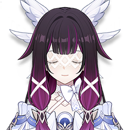 
<b>She noticed you scrolling this far.</b> 
+9999 Primogems. She keeps track of those.

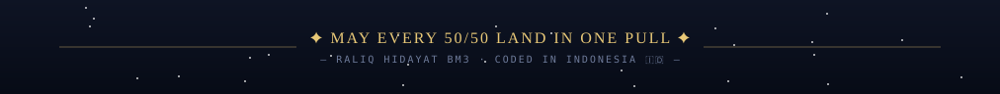

<!-- Genshin Impact™ is a trademark of HoYoverse. Character art © their respective owners, used here strictly as fan decoration — no affiliation, no ownership claimed. All layout, vector art and copy in this profile are original, generated by scripts/generate-assets.mjs. -->
